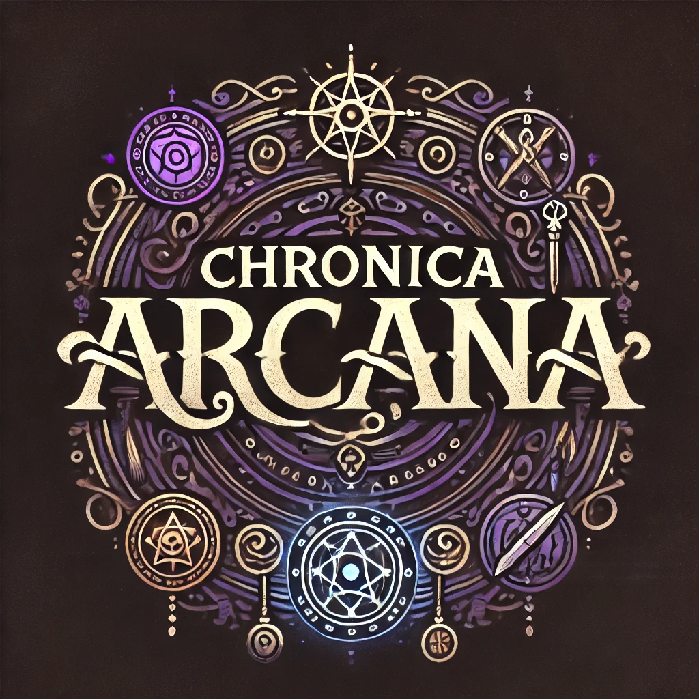

# Ancient Chronicles: Archive of M.A.G.U.S. RPG Writings

<p align="center">
  
</p>

## About This Project

Welcome to the Ancient Chronicles, a modern digital archive dedicated to preserving and showcasing a collection of personal writings for the Hungarian role-playing game, M.A.G.U.S. (Miracle Adeptia Guns Urrus Sorrate). The content on this site was originally written between 2001 and 2002 and was rediscovered on an old CD in May 2023.

This project was born out of a desire to bring these old creations—monsters, character classes, adventures, and poems—back to life. The website is designed to resemble a "disk magazine" (diskmag), a popular format in the early days of personal computing, and is built with modern web technologies.

Some of the original texts were incomplete and have been finished with the assistance of AI (ChatGPT). The site also features AI-generated music (Suno AI) to enhance the fantasy RPG atmosphere.

The project is the work of Dr. Porkoláb Ádám and is licensed under the Creative Commons Attribution-NonCommercial-ShareAlike 4.0 International license.

## Features

- **Content Archive:** A categorized collection of monsters, character classes, adventures, and short stories for M.A.G.U.S.
- **Disk Magazine UI:** A retro-style user interface inspired by old-school disk magazines.
- **Jukebox:** An in-app music player with custom, AI-generated fantasy-themed music.
- **Responsive Design:** The application is designed to work on various screen sizes.

## Tech Stack

This project is a single-page application (SPA) built with the following technologies:

- **[Angular 20](https://angular.io/):** The core framework for building the application.
- **[Bootstrap 5](https://getbootstrap.com/):** For responsive layout and UI components.
- **[FontAwesome](https://fontawesome.com/):** For icons.
- **[TypeScript](https://www.typescriptlang.org/):** The primary programming language.
- **[SCSS](https://sass-lang.com/):** For advanced CSS styling.

## Installation

To get a local copy up and running, follow these simple steps.

### Prerequisites

You need to have [Node.js](https://nodejs.org/) and the [Angular CLI](https://angular.io/cli) installed on your machine.

### Clone the repository

```bash
git clone https://github.com/your-username/ancient-chronicles.git
cd ancient-chronicles
```

### Install Dependencies

Install the project dependencies using npm:

```bash
npm install
```

## Development Server

Run `ng serve` or `npm run watch` for a dev server. Navigate to `http://localhost:4200/`. The application will automatically reload if you change any of the source files.

```bash
ng serve
```

## Build

Run `ng build` to build the project. The build artifacts will be stored in the `dist/ancient-chronicles/` directory.

```bash
ng build
```

The `start` script in `package.json` uses `npx serve` to host the built files. You can run it with:

```bash
npm run start
```

This will serve the application at `http://localhost:3000`.

## Running Tests

Run `ng test` to execute the unit tests via [Karma](https://karma-runner.github.io).

```bash
ng test
```

## License

This project is licensed under the **Creative Commons Attribution-NonCommercial-ShareAlike 4.0 International License**. See the [LICENSE file](https://creativecommons.org/licenses/by-nc-sa/4.0/) for more details.

In short, you are free to share and adapt the material for non-commercial purposes, as long as you give appropriate credit and distribute your contributions under the same license.

## Contact

Dr. Porkoláb Ádám - [adam@porkolab.hu](mailto:adam@porkolab.hu)

Project Link: [https://chronica.porkolab.hu](https://chronica.porkolab.hu)
